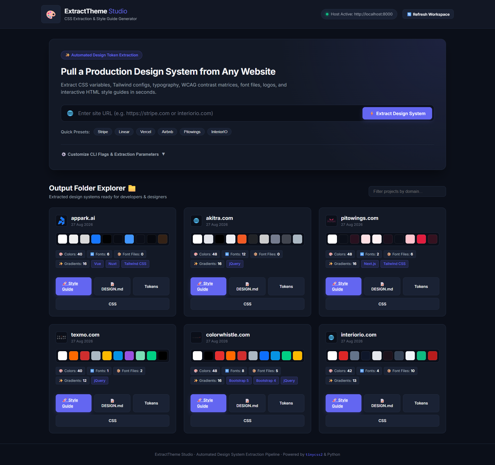

# 🎨 ExtractDesign Studio — Reverse-Engineer Design Systems & Website Intelligence

> **Reverse-engineer design systems, UI components & website intelligence from any live URL.**

**ExtractDesign Studio** is a comprehensive Python CLI tool and Web UI Workbench that crawls any website, parses its CSS stylesheet architecture using `tinycss2`, normalizes visual tokens, performs multi-dimensional audits (Accessibility, Performance, SEO, Security), and outputs complete, production-ready design systems with interactive style guides.




---

## ✨ Features & Capabilities

- 🎨 **Color Palette Normalization**: Groups and converts colors to OKLab perceptual space, merges near-identical shades (`--color-tolerance`), and infers semantic roles (`--bg`, `--surface`, `--ink`, `--accent`, `--line`).
- 🔤 **Typography & Font Extraction**: Extracts font families, type scales, font weights, line-heights, letter-spacing, and automatically downloads original `@font-face` binary files (`.woff2`, `.woff`, `.ttf`) to `fonts/`.
- 🖼️ **Site Logo & Icon Extraction**: Automatically finds and saves SVG logos, header `` logotypes (with Next.js image optimizer support), apple-touch-icons, and high-resolution favicons.
- 💻 **Tech Stack & Framework Detection**: Detects 17+ frontend frameworks and libraries from script signatures and stylesheet declarations (`Next.js`, `React`, `Vue`, `Nuxt`, `Angular`, `Svelte`, `Tailwind CSS`, `Bootstrap`, `MUI`, `Framer Motion`, `GSAP`, `jQuery`).
- 📊 **WCAG 2.1 Contrast Matrix**: Evaluates color pair combinations against WCAG 2.1 AA, AA Large, and AAA accessibility standards.
- ✨ **Gradients & Keyframe Animations**: Scans and indexes linear/radial gradients, `@keyframes` animation names, duration scales, and custom `cubic-bezier` easing curves.
- 🤖 **AI-Ready `DESIGN.md` Prompt**: Emits a structured `DESIGN.md` system prompt reference containing explicit guidelines for AI tools (Antigravity, Cursor, Vibe Coding, Claude, ChatGPT).
- 🚀 **ExtractDesign Studio Web UI**: Hostable web dashboard (`server.py` + `http://localhost:8000`) with interactive flag sliders, URL presets, live chunked terminal output, and a theme folder explorer with live color swatches.

---

## 📁 Output Folder Structure

Running a scan on `https://example.com` creates a domain folder containing:

```
example.com/
├── style-guide.html      # Interactive, self-contained HTML style guide
├── DESIGN.md             # AI system prompt & UI design guidelines
├── design-tokens.json    # Machine-readable JSON design tokens
├── theme.css             # :root CSS custom properties & dark scope
├── components.css        # Buttons, cards, inputs, & badges built on tokens
├── tailwind.theme.css    # Tailwind v4 @theme block
├── tailwind.config.js    # Tailwind v3 config file
├── logo.png / logo.svg   # Extracted site logo / favicon asset
├── fonts/                # Extracted @font-face binary font files (.woff2)
└── raw/
    ├── combined.css      # Consolidated & absolutised stylesheet
    └── sheet-001.css     # Raw fetched stylesheets
```

---

## 🏗️ Codebase Architecture & Structure

The repository is organized into modular packages for maintainability, plug-and-play CLI usage, and multi-tenant scaling:

```
├── core/                  # Core Business Logic & Extraction Engines
│   ├── extractor.py       # Web crawler, CSS parser (tinycss2), font & token extractor
│   ├── analyzer.py        # 6-pillar site intelligence & scoring audit
│   └── storage.py         # Local disk & Cloudflare R2 / AWS S3 hybrid storage provider
│
├── db/                    # Multi-Tenancy & Data Persistence
│   ├── database.py        # SQLite WAL engine, connection pooling, schema migrations
│   └── auth.py            # JWT sessions, RBAC (owner, admin, member, viewer), quota gatekeeper
│
├── public/                # Frontend Presentation Layer
│   ├── index.html         # ExtractDesign Studio SPA dashboard
│   ├── app.css, app.js    # Studio styles & interactive workflows
│   ├── landing.html       # Marketing showcase & public presentation
│   └── landing.css, landing.js
│
├── docs/                  # Modular Technical Documentation
│   ├── README.md          # Documentation index
│   ├── multi_tenant_plan.md # Multi-user/tenant specification & plan
│   ├── market_analysis.md # Value proposition, monetization & customer segments
│   ├── landing_copy.md    # Landing page marketing copy
│   └── assets/            # Screenshots & architecture diagrams
│
├── examples/              # Sample Outputs & Demonstration Demos
│   ├── example-style-guide.html
│   └── example-style-guide_update.html
│
├── api/                   # Cloud & Serverless Deployment Entrypoints
│   ├── index.py           # Vercel WSGI entrypoint for Flask
│   └── requirements.txt
│
└── [Plug-and-play root shims]: server.py, extract_theme.py, analyzer.py, storage.py, auth.py
```


---

## ⚡ Quickstart & Installation

### 1. Requirements & Setup

Ensure Python 3.9+ is installed, then install required dependencies:

```bash
pip install -r requirements.txt
```

---

### 2. Using the CLI

Run `extract_theme.py` with a target domain:

```bash
# Basic single-page extraction
python extract_theme.py https://stripe.com

# Crawl 5 same-site pages with custom max colors
python extract_theme.py https://linear.app --crawl 5 --max-colors 48

# Override output folder name
python extract_theme.py https://vercel.com -o ./my-vercel-theme
```

#### CLI Options & Flags

| Flag | Default | Description |
|---|---|---|
| `--crawl <N>` | `1` | Number of same-site pages to crawl for CSS discovery |
| `--max-colors <N>` | `40` | Maximum distinct colors in extracted palette |
| `--min-count <N>` | `2` | Minimum usage count for a color to be kept |
| `--color-tolerance <N>` | `0.03` | Color merging threshold in OKLab space |
| `--root-font-size <N>` | `16` | Base pixel ratio for `rem` calculations |
| `-o / --out <path>` | Domain Name | Output directory path |
| `--no-verify` | `False` | Disable SSL certificate verification |

---

### 3. Launching the Web UI Studio

**Windows (One-Click Launch):**
Double-click `app-run.bat` or run:
```cmd
app-run.bat
```
This automatically verifies dependencies, releases port 8000, starts the server, and opens your default browser to `http://localhost:8000`.

**Cross-Platform / CLI:**
```bash
python server.py
```

Open **`http://localhost:8000`** in your browser to access the **ExtractDesign Studio Workbench**:
- Interactive extraction controls & live terminal streaming
- Multi-dimensional website intelligence dashboard with 14 in-depth audit tabs
- Output directory explorer with visual theme swatches and token inspection
- One-click launch for `style-guide.html`, Next.js component generator, and modal code viewer for `DESIGN.md`, tokens, and CSS variables.

---

## 💼 Who Benefits & How (Target Audiences)

| Persona / ICP | Current Pain Point | How ExtractDesign Solves It | Measurable Benefit |
| :--- | :--- | :--- | :--- |
| **Freelance Web Designers & Agencies** | Spending 4–8 hours manually inspecting a client's old site or competitor site with DevTools to pitch a redesign. | Enters client URL $\rightarrow$ gets an interactive style guide, brand assets, font files, and WCAG contrast scorecard ready for a pitch deck. | **Saves 4–6 billable hours per pitch.** Increases proposal win-rate by presenting a live interactive style guide before signing the contract. |
| **Frontend Engineers & Devs** | Rebuilding UI components or integrating legacy sites into modern stacks (Tailwind, Next.js, Figma). Typing tokens manually is tedious. | Instant 1-click export to `tailwind.config.js`, `tokens.w3c.json`, Figma Tokens Studio JSON, and TypeScript `theme.ts`. | **Eliminates 1–2 days of boilerplate scaffolding.** Direct copy-paste into production repositories. |
| **UI/UX & Design System Leads** | "Design Debt" — inconsistencies across large enterprise web properties (rogue hex colors, off-grid 13px padding, poor contrast). | The **Visual Consistency Engine** automatically flags rogue colors, off-grid spacing values, and contrast violations. | **Instant automated design audit.** Acts as an objective scorecard to justify redesign budgets to stakeholders. |
| **Growth Marketers & Strategists** | Reverse-engineering competitors' visual positioning, landing page patterns, tech stacks, and font choices. | Extracts typography pairings, visual hierarchy, tech stack breakdown, and brand asset vectors in one click. | **Competitive intelligence** in seconds without needing technical knowledge. |

---

## 🚀 High-Converting Commercial Capabilities

1. **👑 Whitelabeled Client Presentation Link**:
   - Share interactive style guides branded under your agency name (`/output/domain/style-guide.html?agency=Your+Agency&client=Client+Name`).
   - Displays a professional presentation header on the style guide with 1-click client PDF export.

2. **⚡ 1-Click Framework & Figma Configs**:
   - **Figma Tokens**: JSON schema conforming to the Tokens Studio standard for direct import into Figma.
   - **Tailwind CSS**: `tailwind.config.js` extended theme ready for Tailwind v3 and `@theme` block for Tailwind v4.
   - **Next.js & React**: Type-safe `theme.ts` definitions.
   - **W3C Standard**: `tokens.w3c.json` Design Tokens Community Group specification.

3. **📄 Executive Audit Scorecard (Print / PDF)**:
   - A ready-made, print-optimized executive audit summary report detailing:
     - Visual Consistency Score & Letter Grade (A–F)
     - 8pt Spacing Grid Adherence % and rogue deviations
     - WCAG 2.1 Contrast Matrix & accessibility violations
     - Response headers security posture grade
     - Prioritized remediation checklist for client handoff

4. **🕷️ Deep Multi-Page Crawling**:
   - Crawls 5, 10, or 20 subpages across an entire domain to capture all sub-route stylesheets, component variants, and rogue utility classes.

---

## 💳 Pricing & Packaging Model

| Tier | Price | Target Audience | Features Included |
| :--- | :--- | :--- | :--- |
| **Community / Free** | **₹0 / $0** | Casual testing, developers | • 3 scans / month<br>• Color palette & font names<br>• HTML style guide preview<br>• Tech stack detection |
| **Pay-Per-Scan** | **₹149 (~$2) / $9** | Freelancers doing one-off client jobs | • Full brand asset ZIP download<br>• Tailwind, Figma, TypeScript & W3C exports<br>• Full 6-pillar technical audit & consistency report<br>• Zero recurring subscriptions |
| **Pro Subscription** | **₹999/mo (~$12) / $29/mo** | Active freelancers & boutique agencies | • **Unlimited site scans**<br>• Deep crawl up to **20 subpages**<br>• Whitelabel client presentation links<br>• Live Figma Tokens Studio export<br>• Executive PDF scorecards |
| **Agency / Team** | **₹3,999/mo (~$49) / $99/mo** | Digital agencies & design teams | • Team sharing & workspace history<br>• Scheduled automated competitor audits<br>• Dedicated REST API access for CI/CD pipelines |

---

## ⚙️ Workspace & Platform Settings

Access the complete configuration suite at `http://localhost:8000/settings` or via the **Settings** button in the Studio header:

1. **🎨 Brand & Visual Identity**:
   - **Studio / App Name**: Customize the workspace name and browser title.
   - **Accent Theme Color**: Dynamic color picker (with Indigo, Cyan, Emerald, Purple, Amber, Rose presets) that applies live across the entire Studio UI.
   - **Custom Logo & CNAME**: Configure custom domain mappings (`audit.youragency.com`) and custom SVG/PNG logo URLs.

2. **🏷️ Default Whitelabeling Engine**:
   - **Agency / Firm Name**: Set default agency attribution for client links.
   - **Portfolio URL**: Link back to your agency design portfolio.
   - **Footer Attribution & Disclaimer**: Pre-fill customized disclaimers on client style guides and scorecards.
   - **Vendor Shield**: 1-click toggle to hide "Powered by ExtractDesign" branding from all client presentations.
   - **Auto-Print Trigger**: Automatically launch the browser "Save as PDF" dialog when clients open presentation links.

3. **💳 Subscription Plan & Resource Quotas**:
   - **Active Plan Display**: Real-time status badge, billing cycle, and expiration date countdown (e.g. *Renews on October 18, 2026 · 30 days remaining*).
   - **Live Resource Meters**: Track Scans Used, Deep Multi-Page Crawls, and Disk/S3 Storage Quota with visual progress bars.
   - **Interactive Plan Switcher**: Instantly switch between Community Free, Pay-Per-Scan, Pro Agency, and Workspace Enterprise tiers.

4. **⚙️ Extraction Engine & Crawler Settings**:
   - Configure default crawl depth (1, 5, 10, or 20 pages).
   - Request timeout thresholds (15s, 30s, 60s).
   - Toggle raw webfont binary downloads (`.woff2`, `.ttf`).
   - User-Agent engine presets: Desktop Chrome (Default), Mobile Safari (iOS), Googlebot.
   - Bypass self-signed SSL/TLS certificates for internal or staging sites.

5. **🔌 REST API Keys & Webhooks**:
   - Personal API Secret Key management (`sk_live_extract_...`) with reveal, 1-click copy, and regeneration.
   - Webhook delivery endpoint URL for triggering CI/CD pipelines or Slack notifications upon scan completion.
   - Auto-generated `cURL` command snippets.

6. **💾 Data Management**:
   - Purge browser local storage cache.
   - 1-Click factory reset to default settings (`POST /api/settings/reset`).

---

## 🤝 License

Apache-2.0 License. Developed by Karthikeyan T (@carthworks). Built for designers, frontend developers, and AI-driven UI workflows.

