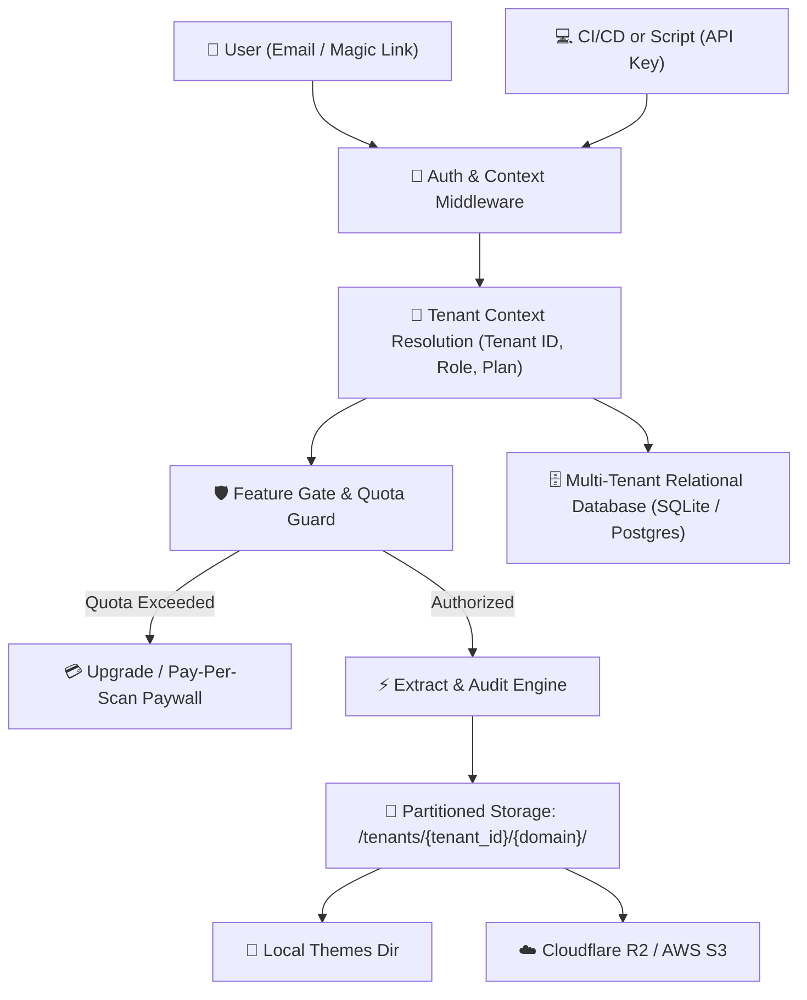

# Implementation Plan: Multi-User, Multi-Tenant & Multi-Plan Architecture

Transform **ExtractDesign Studio** from a single-user local scanner into a scalable, secure, multi-tenant SaaS platform supporting multiple client organizations (tenants), team collaboration (RBAC), strict data isolation, tiered feature gates, usage metering, and billing integrations.

---

## User Review Required

> [!IMPORTANT]
> **Database Selection Strategy**: By default, the plan proposes using **SQLite with WAL mode** (`studio.db`) via Python's built-in `sqlite3` engine with an abstraction layer (or SQLAlchemy) so that the application runs with **zero mandatory external services** locally or in lightweight containers, while enabling an instant switch to **PostgreSQL** (Neon, Supabase, Cloud SQL) in production via an environment variable (`DATABASE_URL`).
> 
> **Backward Compatibility**: Existing extracted themes in `./downloaded-themes/<domain>` will be automatically migrated to a default `"personal"` workspace so no existing scan data is lost.

---

## 1. System Architecture & Tenancy Model



### Core Tenancy Entities

1. **User**: A human account identified by verified email. Can be an owner, admin, or member of multiple Tenants (e.g. their personal freelance workspace + an agency workspace).
2. **Tenant (Workspace / Organization)**: The primary isolation boundary. Holds:
   - Own branding & whitelabel defaults.
   - Separate extracted projects & design systems.
   - Current subscription plan (Free, Pay-Per-Scan, Pro, Agency).
   - Resource quota consumption (scans, crawls, storage).
   - Dedicated API keys and webhooks.
3. **Tenant Member**: Connects a User to a Tenant with a specific Role:
   - `owner`: Billing, workspace deletion, team invites, all scan operations.
   - `admin`: Team invites, settings, all scan operations.
   - `member`: Can create new scans, export tokens, generate client links.
   - `viewer`: Read-only access to existing reports and style guides.

---

## 2. Database Schema Design

```sql
-- 1. Tenants (Organizations / Workspaces)
CREATE TABLE IF NOT EXISTS tenants (
    id TEXT PRIMARY KEY,                       -- e.g. "ten_apex_98f1"
    name TEXT NOT NULL,                        -- e.g. "Apex Digital Studio"
    slug TEXT UNIQUE NOT NULL,                 -- e.g. "apex-digital"
    plan_id TEXT NOT NULL DEFAULT 'free',      -- 'free', 'pay_per_scan', 'pro', 'agency'
    plan_status TEXT NOT NULL DEFAULT 'active',-- 'active', 'past_due', 'canceled'
    billing_cycle TEXT DEFAULT 'monthly',      -- 'monthly', 'annual'
    current_period_end TIMESTAMP,
    stripe_customer_id TEXT,
    stripe_subscription_id TEXT,
    custom_domain TEXT,                        -- e.g. "audit.apexdigital.design"
    brand_settings JSON,                       -- accent_color, logo_url, custom_name
    whitelabel_settings JSON,                  -- agency_name, agency_url, hide_brand
    created_at TIMESTAMP DEFAULT CURRENT_TIMESTAMP,
    updated_at TIMESTAMP DEFAULT CURRENT_TIMESTAMP
);

-- 2. Users
CREATE TABLE IF NOT EXISTS users (
    id TEXT PRIMARY KEY,                       -- e.g. "usr_4a8b2c"
    email TEXT UNIQUE NOT NULL,
    full_name TEXT,
    avatar_url TEXT,
    is_platform_admin BOOLEAN DEFAULT FALSE,
    created_at TIMESTAMP DEFAULT CURRENT_TIMESTAMP,
    last_login_at TIMESTAMP
);

-- 3. Tenant Memberships (RBAC)
CREATE TABLE IF NOT EXISTS tenant_members (
    tenant_id TEXT NOT NULL REFERENCES tenants(id) ON DELETE CASCADE,
    user_id TEXT NOT NULL REFERENCES users(id) ON DELETE CASCADE,
    role TEXT NOT NULL DEFAULT 'member',       -- 'owner', 'admin', 'member', 'viewer'
    created_at TIMESTAMP DEFAULT CURRENT_TIMESTAMP,
    PRIMARY KEY (tenant_id, user_id)
);

-- 4. Plans & Limits Reference
CREATE TABLE IF NOT EXISTS plans (
    id TEXT PRIMARY KEY,                       -- 'free', 'pay_per_scan', 'pro', 'agency'
    name TEXT NOT NULL,
    price_inr INTEGER NOT NULL,                -- e.g. 0, 149, 999, 3999
    price_usd INTEGER NOT NULL,                -- e.g. 0, 9, 29, 99
    monthly_scans_limit INTEGER,               -- 3, NULL (unlimited), etc.
    max_crawl_depth INTEGER NOT NULL,          -- 1, 5, 10, 20
    figma_export_allowed BOOLEAN DEFAULT FALSE,
    whitelabel_allowed BOOLEAN DEFAULT FALSE,
    executive_scorecard_allowed BOOLEAN DEFAULT FALSE,
    api_access_allowed BOOLEAN DEFAULT FALSE,
    webhooks_allowed BOOLEAN DEFAULT FALSE,
    max_team_seats INTEGER DEFAULT 1,
    storage_limit_mb INTEGER DEFAULT 500
);

-- 5. Tenant Usage Quotas & Metering
CREATE TABLE IF NOT EXISTS tenant_quotas (
    tenant_id TEXT PRIMARY KEY REFERENCES tenants(id) ON DELETE CASCADE,
    billing_period_start TIMESTAMP NOT NULL,
    billing_period_end TIMESTAMP NOT NULL,
    scans_count INTEGER DEFAULT 0,
    crawls_count INTEGER DEFAULT 0,
    storage_bytes_used INTEGER DEFAULT 0,
    pay_per_scan_credits INTEGER DEFAULT 0     -- Purchased credits for pay-per-scan tier
);

-- 6. Tenant Scanned Projects (Isolated Directory & Storage)
CREATE TABLE IF NOT EXISTS tenant_projects (
    id TEXT PRIMARY KEY,
    tenant_id TEXT NOT NULL REFERENCES tenants(id) ON DELETE CASCADE,
    domain TEXT NOT NULL,
    storage_path TEXT NOT NULL,                -- 'tenants/{tenant_id}/{domain}/'
    created_by_user_id TEXT REFERENCES users(id),
    crawl_depth INTEGER DEFAULT 1,
    scores JSON,                               -- Cached 6-pillar audit summary
    meta JSON,                                 -- Archetype, frameworks, components count
    created_at TIMESTAMP DEFAULT CURRENT_TIMESTAMP,
    updated_at TIMESTAMP DEFAULT CURRENT_TIMESTAMP,
    UNIQUE(tenant_id, domain)
);

-- 7. API Keys & Service Tokens
CREATE TABLE IF NOT EXISTS api_keys (
    id TEXT PRIMARY KEY,
    tenant_id TEXT NOT NULL REFERENCES tenants(id) ON DELETE CASCADE,
    user_id TEXT NOT NULL REFERENCES users(id) ON DELETE CASCADE,
    key_hash TEXT UNIQUE NOT NULL,
    key_prefix TEXT NOT NULL,                  -- e.g. "sk_live_apex_"
    name TEXT NOT NULL,
    last_used_at TIMESTAMP,
    created_at TIMESTAMP DEFAULT CURRENT_TIMESTAMP
);
```

---

## 3. Tiered Plan Matrix & Gatekeeper Enforcement

| Feature Capability | Free Tier (₹0) | Pay-Per-Scan (₹149 / $9) | Pro Tier (₹999/mo / $29) | Agency Workspace (₹3,999/mo / $99) |
| :--- | :--- | :--- | :--- | :--- |
| **Scans / Month** | 3 single-page scans | 1 credit per scan | **Unlimited** scans | **Unlimited** scans |
| **Max Crawl Depth** | 1 page | 5 pages | Up to 10 pages | Up to **20 pages** |
| **Output Access** | Online preview only | Full ZIP download | Full ZIP download | Full ZIP download |
| **Figma Tokens Studio** | ❌ Blocked | ✅ Included in scan | ✅ Full sync export | ✅ Full sync export |
| **Framework Exports** | Basic CSS `:root` | Tailwind + TypeScript | Tailwind + TypeScript + Vue | All Frameworks |
| **Whitelabel Presentation** | ❌ Vendor badge fixed | ❌ Vendor badge fixed | ✅ Custom Agency Link | ✅ Custom CNAME + Shield |
| **Executive Audit PDF** | ❌ | ✅ Single report | ✅ Unlimited PDF export | ✅ Unlimited PDF export |
| **Team Seats** | 1 user | 1 user | 3 team seats | Up to **10 team seats** |
| **API & Webhooks** | ❌ | ❌ | ❌ | ✅ Dedicated API + Webhooks |
| **Storage Quota** | 100 MB | 1 GB / scan | 10 GB cloud storage | 100 GB cloud storage |

### Gatekeeper Middleware Enforcement Logic:
```python
def require_plan_feature(feature_name: str):
    """Decorator ensuring current tenant's plan permits the requested action."""
    def decorator(f):
        @wraps(f)
        def wrapper(*args, **kwargs):
            tenant = g.current_tenant
            if not tenant.can_access_feature(feature_name):
                return jsonify({
                    "error": "feature_locked",
                    "message": f"The '{feature_name}' feature requires upgrading to the Pro or Agency plan.",
                    "required_plan": tenant.get_required_plan_for(feature_name),
                    "upgrade_url": f"/studio#settings?tab=plan&upgrade={feature_name}"
                }), 403
            return f(*args, **kwargs)
        return wrapper
    return decorator
```

---

## 4. Multi-Tenant Storage Partitioning

Currently, scans output to `./downloaded-themes/<domain>`. In the multi-tenant architecture:

1. **Filesystem Organization**:
   ```
   downloaded-themes/
   └── tenants/
       ├── ten_personal_default/
       │   └── stripe.com/
       └── ten_apex_agency_98f1/
           ├── stripe.com/
           └── linear.app/
   ```
2. **Cloud Object Storage (S3 / Cloudflare R2)**:
   - Partition prefix: `tenants/{tenant_id}/{domain}/style-guide.html`
   - Complete isolation: Tenant A cannot guess or view Tenant B's URLs or assets.
3. **Public Whitelabeled Links**:
   - `https://studio.domain/share/{tenant_slug}/{domain}?token=...`
   - Signed verification tokens ensure only clients with the authorized share link can access the interactive style guide.

---

## 5. Proposed Phased Implementation

### Phase 1: Database Layer & Migration (`db.py`)
- Create `db.py` managing SQLite/PostgreSQL connections with connection pooling and thread safety.
- Initialize the 7 core tables: `tenants`, `users`, `tenant_members`, `plans`, `tenant_quotas`, `tenant_projects`, and `api_keys`.
- Seed standard plan definitions (Free, Pay-Per-Scan, Pro, Agency).
- Implement automated migration helper to register any existing local project folders into a default `personal` workspace.

### Phase 2: Authentication & Multi-Tenant Context (`auth.py`)
- Expand `/api/auth/magic-link`:
  - Issues signed JWT tokens storing `{ user_id, email, active_tenant_id }`.
  - Stored in secure `HttpOnly` cookie with fallback to `Authorization: Bearer <jwt>`.
- Tenant Context Resolver:
  - Inspects JWT, `X-Tenant-ID` header, or API Key.
  - Attaches `g.current_user`, `g.current_tenant`, and `g.tenant_role` to Flask's request lifecycle.
- Endpoints:
  - `GET /api/user/me`: Current profile and list of all accessible tenants.
  - `POST /api/user/switch-tenant`: Switches active workspace.
  - `POST /api/tenants`: Create a new workspace/organization.

### Phase 3: Quota Guard & Tenant-Scoped Projects (`server.py`)
- Refactor `/api/projects` to scope queries strictly to `tenant_projects.tenant_id = :tenant_id`.
- Update `/api/extract` to enforce:
  - Monthly scan quota limit check before launching extraction.
  - Maximum crawl depth clamp based on active plan.
  - Storage consumption accounting.
- Output path partitioning: Saves to `downloaded-themes/tenants/{tenant_id}/{domain}/`.

### Phase 4: Team Member Management & Invites
- Endpoints:
  - `GET /api/tenants/{id}/members`: List workspace collaborators and roles.
  - `POST /api/tenants/{id}/invites`: Send team invite email / generate magic join link.
  - `PATCH /api/tenants/{id}/members/{user_id}`: Change role (Admin, Member, Viewer).
  - `DELETE /api/tenants/{id}/members/{user_id}`: Remove team member.

### Phase 5: Studio UI Multi-Tenant Extensions (`public/`)
- **Workspace Switcher Dropdown** in Studio top header:
  - Display active workspace name with plan badge.
  - 1-click switch between Personal, Agency, and Client workspaces.
  - "+ Create New Workspace" trigger.
- **Team Management Tab** in Settings Modal:
  - Collaborators table with avatar, role selector, and "Invite Team Member" form.
- **Plan Gate Badges & Upgrade Triggers**:
  - Locked badges on Crawl Depth > 1 or Figma Tokens if on Free plan.
  - 1-click upgrade modal opening plan selection.

### Phase 6: Billing & Payment Webhooks (Stripe / Razorpay)
- `POST /api/billing/create-checkout-session`: Generates hosted checkout for Pro / Agency subscription or Pay-Per-Scan credits.
- `POST /api/billing/webhook`: Handles subscription lifecycle (`invoice.paid`, `customer.subscription.updated`, `customer.subscription.deleted`).

---

## 6. Verification Plan

### Automated Tests
1. **Multi-Tenant Isolation Test**:
   - Create Tenant A and Tenant B.
implementation_plan_multi_tenent   - Scan `stripe.com` in Tenant A.
   - Assert `GET /api/projects` for Tenant B returns 0 projects.
2. **Quota & Gatekeeper Enforcement Test**:
   - Set Tenant A to Free plan (3 scans max).
   - Execute 3 scans.
   - Assert 4th scan returns HTTP 403 `quota_exceeded`.
   - Set Crawl Depth to 10 on Free plan; assert validation clamps or rejects with 403.
3. **RBAC Permission Test**:
   - Add User 2 as `viewer` in Tenant A.
   - Attempt `POST /api/extract` as User 2; assert HTTP 403 `permission_denied`.

### Manual Verification
- Log in with test user via magic link.
- Switch between 2 distinct workspaces via the header dropdown.
- Verify that settings (Brand, Whitelabel, Accent color) are completely distinct per workspace.
- Generate an API key and verify `curl` calls correctly attribute to the designated workspace.
